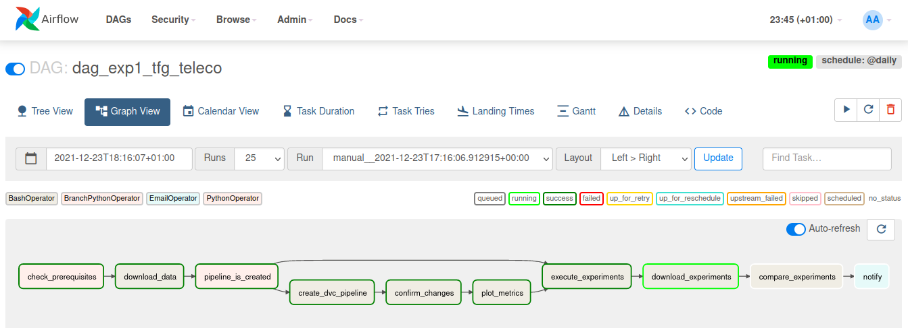
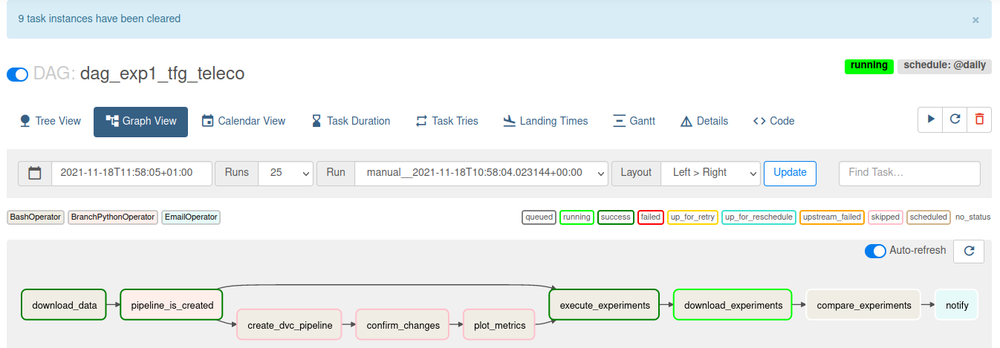

## First use case

Before executing this experiment check [`exp1/README.m`](https://github.com/meridiaz/MLOps-Evaluation/blob/main/exp1/README.md) file.

`exp1` folder constains the following files:
- Raw data downloaded from Kaggle will be located in `data/downloaded_data`
- Clean raw data will be located in `data/prepared_data`
- `dvc_plots` folder contains some examples of plots created by DVC 
- `evaluation` folder contains all metrics and JSON files used by DVC in creating those plots
- `src` folder contains all source code needed to run the pipeline
- `params.yaml` file contains all the configurable parameters for processing the data and creating the model
- `dvc.yaml` file is the declaration of the dvc pipeline, while `dvc.lock`file contain metadata used by DVC to track pipeline output files
- `my_env.yaml` file is the declaration of an Anaconda envivoronment needed to activate to execute this use case
- Note that by default DVC creates a local `.gitignore` file to ignore big files that must not be tracked by git, such as model.pkl and data/downloaded_data folder, 

### DVC Demo

Here is shown a demo in wich two experiments are execute, one of them in a temp dir and the other locally. Then one of the is uploaded to git remote and delete from workspace. After that it is downloaded from git remote back to workspace


### Airflow screenshoots and Demo

As you can see in demo is shown Airflow`s home page with all created DAGs, then exp1 DAG is shown with some logs, finally all Airflow variables needed to run this use case are shown


Bellow are shown some images that show the status of tasks depending on whether one branch or another is running




```
