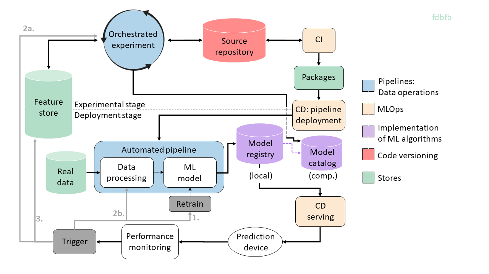
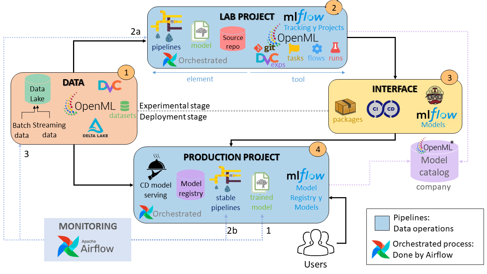

## About this project

Nowadays, there is no common methodology or definition for the creation of machine learning (ML) models and their deployment to production in an optimal and automated way. Some companies manage to carry out this process inefficiently and invest large amounts of resources in it.

This project aims to highlight the current situation in which companies find themselves, to analyze the stages that make up the life cycle of an ML model and finally, to propose and clarify the elements, functions and technologies necessary to carry out the above process automatically with almost no manual intervention.

### Contribution of this project
The methodologies and techniques that allow this process to be carried out are known as machine learning operations.

This project has propose an architecture to create an deploy ML models automatically, see bellow:

Some important elements are:
- **Orchestrated experiment pipeline:** creates automatically models only specifying some parameters and the type of model
- **CI:** ensures that all elements are tested before deployment
- **Packages:** contains everything needed to deploy the pipeline and model to production
- **Automated pipeline:** this pipeline automatically deploys the trained models in production and processes the data for which you want to make predictions
- **Model registry:** stores all the versions of the trained models, belonging to a single project, controlling their passage to production
- **Model catalog:** stores a record of the models of the entire company, indicating the decisions that led to this solution
- **Performance monitoring:** is responsible for checking that the performance of the deployed models remains above a threshold, otherwise a trigger occurs and a decision needs to be made: 1, 2a, 2b or 3.

This project also associates those software tools that allow this whole process to be carried out, see image bellow:

All the tools associated with the concept of MLOps by accessing this link on [this link](https://github.com/EthicalML/awesome-production-machine-learning#model-serving-and-monitoring)

As you can see pipelines are a key concept, they provide a way to automated and modularize task in order to build flexible, reusable, easy-to-use and debug code.

For further reading please check bachelor thesis above button.

### Use cases

Two simple cases have been implemented to illustrate in a practical way some of the above concepts. They can be found in `exp1` and `exp2` folders.

Tools used are [DVC](https://dvc.org/), [Mlflow](https://www.mlflow.org/) and [Apache Airflow](https://airflow.apache.org/docs/apache-airflow/stable/index.html)

- [**First use case**](/exp1.md) uses DVC and Apache Airflow tools. First one is used to create a pipeline to process raw data and create models. This pipeline can be used to execute some experiments in which you can change some parameters and then you can share them with other experts. On the other hand, Airflow is used to automate all this process and to provide an interface for managing and visualizing the execution of tasks. Follow [this link](/exp1.md) for more information. 
- [**Second use case**](/exp2.md)  uses MLflow and Apache Airflow tools. First one is used to create a pipeline to process raw data and create models, tracking metrics of the created models, store them in a model registry and deploy them locally. Again Airflow is used to automate the process of executing this tasks. Follow [this link](/exp2.md) for more information.

Before executing any of this cases please check `README.md` file to check all requisities needed.

